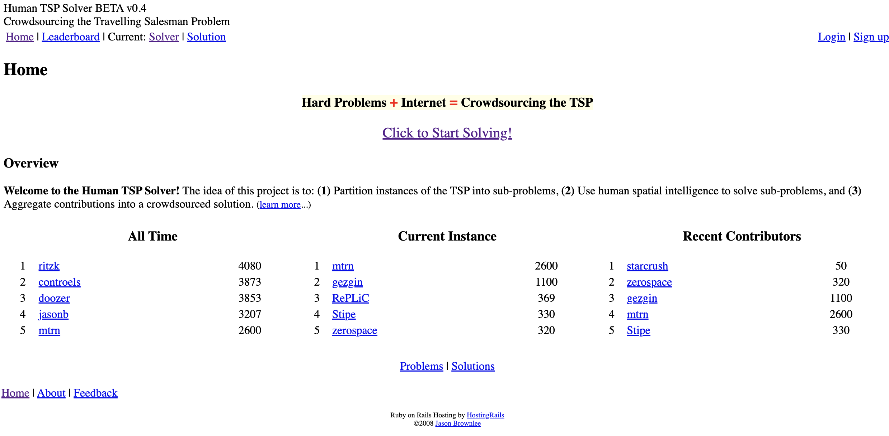

# Human TSP Solver

This archive provides an archive of files from the **humanTSPsolver** experiment hosted on `humantspsolver.com` circa 2008, developed by Jason Brownlee.

## About

The idea of this project is to: (1) Partition instances of the TSP into sub-problems, (2) Use human spatial intelligence to solve sub-problems, and (3) Aggregate contributions into a crowdsourced solution

The site was built to investigate the question:

* Can human spatial intelligence be harnessed to solve instances of the Travelling Salesman Problem?

The approach taken involves: (1) partitioning TSP instances into sub-problems, (2) allowing users to make contributions in the context of the sub-problems, and (3) aggregating the contributions into a holistic solution. A database of problems is maintained, and contributions are recorded against instances of those problems, where an instances are rotated periodically.

Sub-problems are selected randomly with re-selection of sub-problems. The process involves firstly the selection of a random city in the broader problem, then the selection of a limited number of cities with a minimum distance to the selected origin city.

Contributions are provided by users in the form of edges between cities in presented sub-problems. There is no discrimination of of contributions, meaning that users are free to contribute whatever they feel may be relevant or useful to the problem . Contributions are aggregated and stored as a frequency for each distinct edge in an incidence adjacency list.

The stored contributions provide a summary of those edges that are expected to be useful in solving the broader TSP (far fewer than the possible set of edges). These may be explored by a deterministic or probabilistic algorithm, or by the users themselves to provide a holistic solution to a problem instance.

## Technology

The website was developed using an early version of Ruby on Rails an was hosted on an early version of the Heroku service.

The interaction with the fragments of traveling salesman problems was managed via Java applets with a graphical interface.

Partial solutions were collected into a MySQL database.

### Screenshot

## Code

### Website and Database

A backup of the ruby on rails website and MySQL database was collected before the project was shutdown, circa May 2009.

* [humantspsolver-final.zip](code/humantspsolver-final.zip)
	* [humantspsolver-final](code/humantspsolver-final/)

An earlier backup of the website wade circa December 2008

* [solver-20081220.zip](code/solver-20081220.zip)
	* [solver](code/solver/)

### Java Applets

A backup of the Java applet source code for adding solutions to TSP fragments was made circa December 2008.

* [solverapplet-20081220.zip](code/solverapplet-20081220.zip)
	* [solverapplet](code/solverapplet/)

## Publications

### Presentations

These are the presentation slides used by Jason Brownlee to present the humanTSPsolver project to the complex intelligent systems lab, Swinburne University in 2008. The slides review the premise of the project which is that a crowdsource model may be useful in solving very complex problem instances.

* [Crowdsourcing NP-Complete Problems On The Web](writing/Crowdsourcing-NP-Complete-Problems-on-the-Web-Presentation-Slides.pdf) (Presentation Slides)

### Blog Posts

Many blog posts were written and published on `neverreadpassively.com` on the conception and development of the idea.

* [Crowdsourcing NP-Complete Problems](http://www.neverreadpassively.com/2008/04/crowdsourcing-np-complete-problems.html), Monday, April 28, 2008 (archived)
* [Considering User Experience in Crowdsourced Problem Solving](https://web.archive.org/web/20081227062141/http://www.neverreadpassively.com/2008/04/considering-user-experience-in.html), Tuesday, April 29, 2008 (archived)
* [Connect The Dots: A Human-Based TSP Solver](https://web.archive.org/web/20081227071013/http://www.neverreadpassively.com/2008/04/connect-dots-human-based-tsp-solver.html), Wednesday, April 30, 2008 (archived)
* [Human TSP Solver](https://web.archive.org/web/20081227074645/http://www.neverreadpassively.com/2008/05/human-tsp-solver.html), Saturday, May 17, 2008 (archived)
* [William Cook and the TSP @ Georgia Tech](https://web.archive.org/web/20081227065953/http://www.neverreadpassively.com/2008/05/william-cook-and-tsp-georgia-tech.html), Monday, May 19, 2008 (archived)
* [Human TSP Solvers and the Convex Hull Hypothesis](https://web.archive.org/web/20081227071018/http://www.neverreadpassively.com/2008/05/human-tsp-solvers-and-convex-hull.html), Saturday, May 24, 2008 (archived)
* [TSPLIB: A Library of Standard TSP Instances](https://web.archive.org/web/20081021071956/http://www.neverreadpassively.com/2008/05/tsplib-library-of-standard-tsp.html), Monday, May 19, 2008 (archived)
* [A Human TSP Solver in Rails, One Month On](https://web.archive.org/web/20081227074119/http://www.neverreadpassively.com/2008/05/human-tsp-solver-in-rails-one-month-on.html), Monday, May 26, 2008 (archived)
* [Human Powered Databases: Some Lessons Learned](https://web.archive.org/web/20081226220730/http://www.neverreadpassively.com/2008/06/human-powered-databases-some-lessons.html), Tuesday, June 3, 2008 (archived)
* [More Lessons Regarding Crowdsourcing](https://web.archive.org/web/20081226215432/http://www.neverreadpassively.com/2008/06/more-lessons-regarding-crowdsourcing.html), Wednesday, June 4, 2008 (archived)

## Sources

* [HumanTSPSolver.com](https://web.archive.org/web/20090427104057/http://humantspsolver.com/) (archived)
* [NeverReadPassively.com](https://web.archive.org/web/20081220021721/http://www.neverreadpassively.com/) (archived)